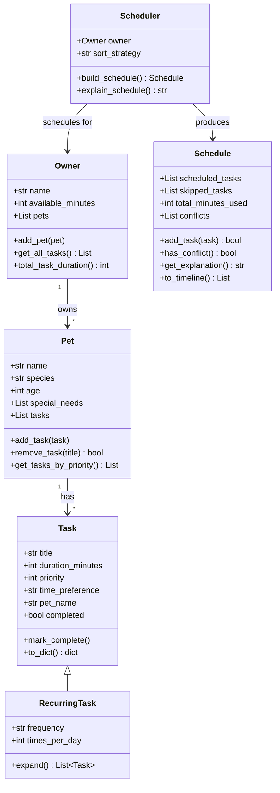

# PawPal+

A smart pet care management system that helps owners plan and schedule daily care tasks for their pets. Built with Python OOP and Streamlit.

## Features

- **Multi-pet support** — manage tasks for multiple pets in one schedule
- **Priority-based scheduling** — greedy algorithm packs high-priority tasks first
- **Three sort strategies** — sort by priority, duration, or time of day
- **Recurring tasks** — walks, feedings, and medications that repeat throughout the day
- **Conflict detection** — flags when total task time exceeds available time and detects duplicates
- **Schedule explanation** — every decision is transparent with detailed reasoning
- **Streamlit UI** — interactive sidebar for setup, timeline display for the schedule

## System Design (UML)



## How the Scheduler Works

The scheduler uses a **greedy algorithm** to build a daily care plan:

1. **Expand** — RecurringTasks (e.g., "Feed x3/day") are expanded into concrete Task instances distributed across morning, afternoon, and evening.
2. **Sort** — All tasks are sorted by the selected strategy:
   - *Priority*: Critical (1) tasks first, Optional (5) last
   - *Duration*: Shortest tasks first (fits more tasks)
   - *Time preference*: Morning tasks first, then afternoon, then evening
3. **Detect conflicts** — Check if total task duration exceeds available time; flag duplicate tasks.
4. **Greedy fill** — Iterate through sorted tasks and add each one if it fits within the remaining time budget. Tasks that don't fit are recorded as "skipped" with a reason.
5. **Explain** — Generate a human-readable breakdown of what was scheduled, what was skipped, and why.

## Project Structure

```
pawpal_system.py   -- Backend: Task, RecurringTask, Pet, Owner, Schedule, Scheduler
app.py             -- Streamlit UI connected to the backend
demo.py            -- CLI script to verify backend logic without UI
test_pawpal.py     -- pytest suite (53 tests)
requirements.txt   -- Dependencies (streamlit, pytest)
reflection.md      -- Project reflection
```

## Setup and Run

```bash
# Clone the repo
git clone https://github.com/sandeepvijayarao09/ai110-module2show-pawpal-starter.git
cd ai110-module2show-pawpal-starter

# Create virtual environment (optional)
python3 -m venv venv
source venv/bin/activate

# Install dependencies
pip install -r requirements.txt

# Run the CLI demo
python demo.py

# Run tests
pytest test_pawpal.py -v

# Launch the Streamlit app
streamlit run app.py
```

## Usage

1. **Add pets** in the sidebar (name, species, age, special needs)
2. **Add tasks** for each pet (title, duration, priority 1-5, time preference, recurring toggle)
3. **Choose a sort strategy** (priority, duration, or time preference)
4. **Click "Generate Schedule"** to see the optimized daily care plan
5. Review the **timeline**, **skipped tasks**, and **explanation**

## Testing

53 tests covering all 6 classes plus an end-to-end integration test:

```
pytest test_pawpal.py -v
```

Test categories:
- Input validation (invalid priority, duration, species, etc.)
- Task expansion (RecurringTask produces correct number of tasks)
- Pet/Owner task aggregation
- Schedule budget enforcement (tasks exceeding time are skipped)
- Scheduler sorting strategies
- Conflict detection
- Full workflow integration
